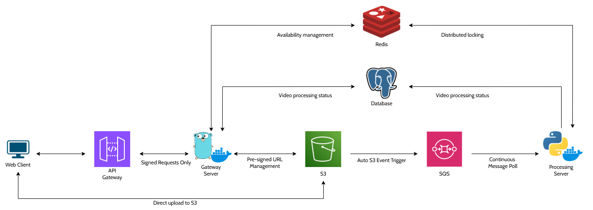
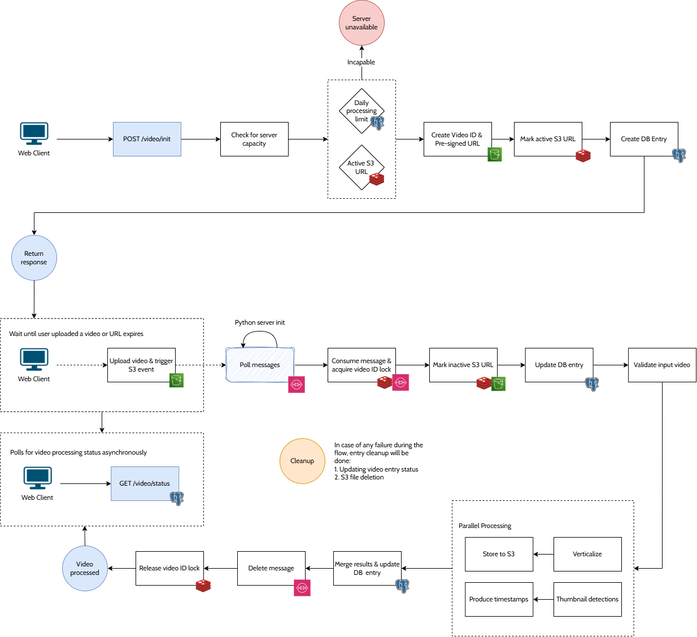
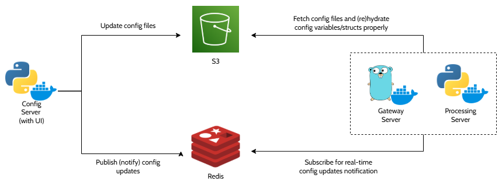
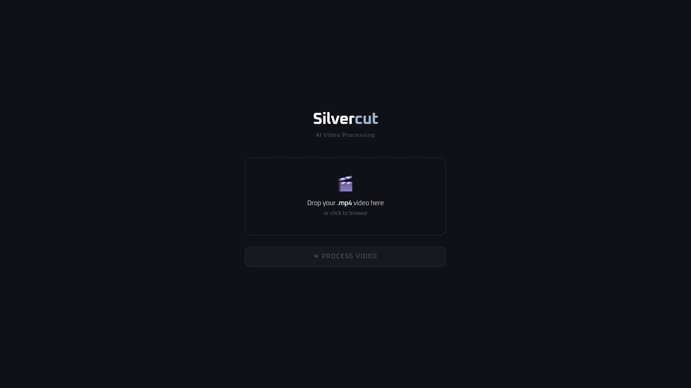
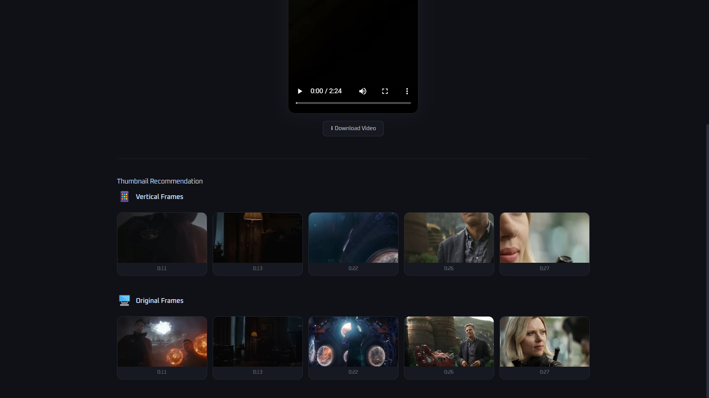

# Silvercut

  

This project turns horizontal videos into vertical format with smart auto-focus and generates thumbnails. Basically addressing the need for content creators who want to repurpose their landscape videos for mobile platforms.

## How it works

The architecture is pretty straightforward, async processing with decoupled services. I think this is one of those cases where splitting things up actually makes sense, not just to follow the microservice-over-monolith hype.

### The problems I needed to solve

1. Video processing is heavy on compute and takes time
2. Video uploads are large and create significant workload on the server
3. Users need to know the progress without blocking

### How I approached it

1. Split the processing server from the main gateway server that handles user requests
2. Let users upload directly to cloud storage (S3) using pre-signed URLs, so the main server doesn't deal with video uploads at all
3. Use a message queue for communication between gateway and processing servers
4. Store job status in a database so users can check progress anytime

I also added some other stuff like signed requests for additional security, runtime config management, and availability tracking. Mostly to keep things manageable and stay within free-tier limits.

### High-Level Diagram

I had access to AWS free tier during development, but the design isn't locked to AWS, you could swap in GCP, Azure, or whatever.

Core components you'd need:
- Docker image registry and deployment platform
- Cloud storage with event triggers (to detect when users upload videos)
- Message queue for async communication
- Persistent database for tracking jobs
- In-memory database (like Redis) for pub/sub and real-time stuff

### Flow Diagram

The flow diagram shows how everything connects end-to-end. The client only interacts with three things:

1. Initialize processing endpoint to start job tracking and get upload URL
2. Status endpoint to check progress and gets results
3. Direct upload to S3 using the pre-signed URL

This way the gateway server doesn't handle any video uploads, which keeps things fast and reduces server load.

## Other Features

These aren't critical to the core functionality but they're things I wanted to implement for a more complete system.

### Runtime Config Management

I separated secret environment variables from regular config variables (timeouts, rate limits, feature flags, etc.). These are things you'd want to change without redeploying the whole service.

My setup uses S3 as the source of truth for config files and Redis for real-time updates across services. I also built a simple config server with Flask to manage everything with a basic UI. I didn't create proper SDKs for integration—just implemented what worked for each service as needed.

### Signed Request

Read my blog here, [medium](https://medium.com/@deeonanugrah/detecting-troublesome-arbitrary-api-traffic-by-bots-or-not-c3acaf0ca901) 😄

I wanted to try implementing request signing in a real application. Turned out it also helped keep infrastructure costs down by preventing random API abuse.

The idea is simple: each request needs a signature generated from the request data and a shared secret. This means you can't just use Postman or curl to hit the API—you need to use the actual frontend client or figure out how the signing works.

It's not bulletproof security, but it raises the bar enough to keep casual abuse out and helps me stay within free-tier limits.

## Demo

This repo is for showcase and documentation. The actual codebase is kept private.

If you want to try it live, drop me a DM!

### Screenshots

